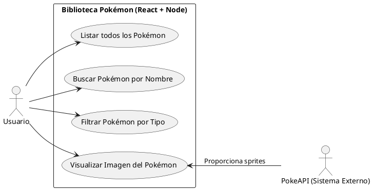
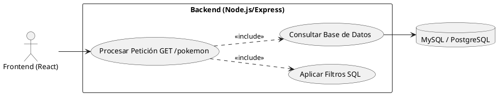
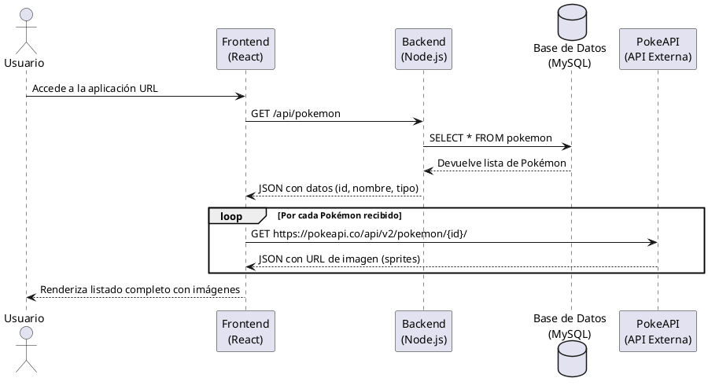
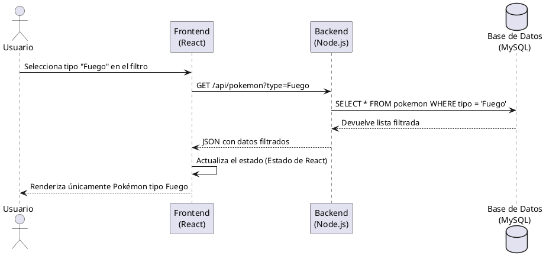

# PARTE 2 – DIAGRAMAS UML

A continuación se presentan los diagramas UML modelados en código compatible con PlantUML. Puedes copiar cada bloque y pegarlo en una herramienta como PlantText (planttext.com) o en un plugin de VSCode para visualizarlos.

## 1. Diagramas de Casos de Uso

### Caso de Uso 1: Interacción General del Usuario
Muestra las acciones principales que el Actor (Usuario) puede realizar en la aplicación.

### Caso de Uso 2: Gestión de Datos en el Backend (Sistema)
Muestra cómo el backend maneja las peticiones recibidas del frontend.

## 2. Diagramas de Secuencia

### Secuencia 1: Carga Inicial de la Lista de Pokémon
Diagrama que describe el flujo completo desde que el usuario abre la web hasta que se muestran los Pokémon con sus imágenes.

### Secuencia 2: Filtrado por Tipo
Flujo cuando un usuario decide elegir un tipo específico (ej. "Fuego") para filtrar la lista.

