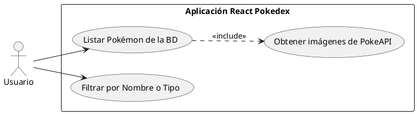
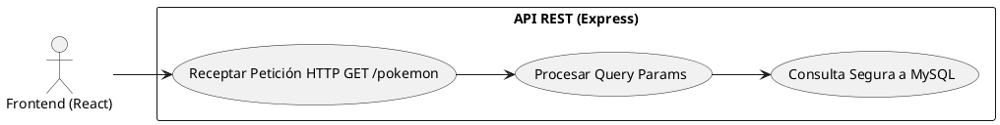
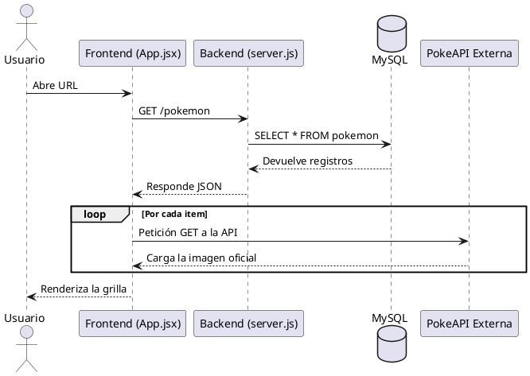
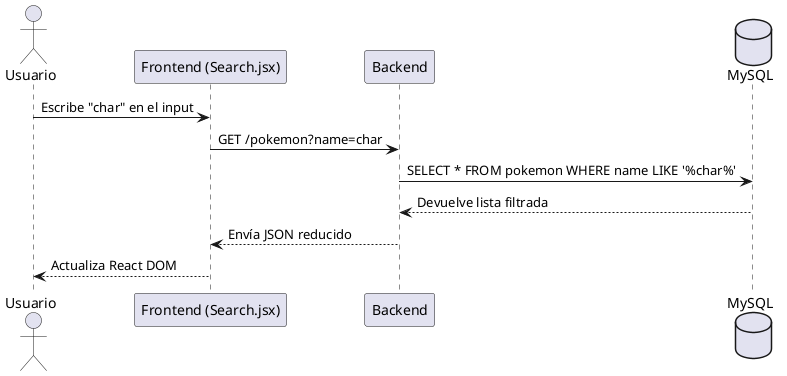

# 6. Diagramas UML

Formato PlantUML listo para renderizar, por ejemplo en planttext.com.

## 1. Diagrama de Casos de Uso (Interacción del Usuario)

## 2. Diagrama de Casos de Uso (Arquitectura Backend)

## 3. Diagrama de Secuencia (Carga Inicial y Visualización)

## 4. Diagrama de Secuencia (Filtrado Básico)

